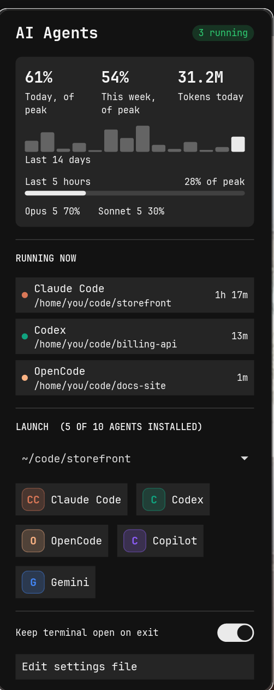

# cosmic-ext-applet-agents

A COSMIC panel applet for AI coding agents, in the spirit of the Omarchy agents
widget: launch an agent in any project directory, see which ones are running,
and watch what they are costing you.



## What it shows

- **Panel button** with the number of agent processes currently running.
- **Usage card** with today's and this week's usage as a percentage, today's
  token count, a 14 day bar chart and a rolling five hour gauge. Percentages are
  of your `daily_budget` and `weekly_budget` when you set them, and of the
  busiest day and week on record when you do not.
- **Running now**: every agent process owned by you, with its working directory
  and uptime. Clicking a row raises the terminal window that agent is running in.
  Windows are recognised when the applet launches them, since the COSMIC toplevel
  protocols carry no process id; rows for agents started elsewhere, and rows whose
  window has since been closed, fall back to opening the directory.
- **Launch**: one tile per agent CLI found on your login shell's PATH, plus a
  picker for the directory to start it in. The list of directories is built from
  the projects your agents have been working in.

## Install

```sh
./install.sh            # builds and installs into ~/.local
./install.sh --enable   # also adds the applet to the right side of the panel
```

Then log out and back in, or restart the panel with `pkill -x cosmic-panel`.
Without `--enable`, add it from Settings > Desktop > Panel > Configure panel
applets.

## Settings

`~/.config/cosmic-ext-applet-agents/config.json` is written with defaults on first
run.

| Key | Meaning |
| --- | --- |
| `terminal` | Terminal invocation. `%d` is the working directory, `%c` the agent command line, `%s` the login shell. |
| `keep_shell_open` | Drop into an interactive shell when the agent exits instead of closing the window. |
| `project_dirs` | Directories pinned to the top of the launch target list. |
| `daily_budget` / `weekly_budget` | What the percentages are measured against, in dollars. Unset means your own busiest day and week are used instead. |
| `pricing` | Input and output price per million tokens, keyed by a model id substring. The longest matching key wins, so `sonnet-4-6` overrides `sonnet`. |

## How the numbers are worked out

Usage is read from the Claude Code transcripts under `~/.claude/projects`. Each
assistant message carries its model and its token counts, which are multiplied
by the `pricing` table: cache writes at 1.25x the input rate and cache reads at
0.1x, matching Anthropic's published multipliers. The result is an **estimate of
what the same traffic would cost on the API**. It is not a bill, and it does not
know about subscription plans.

Transcripts are append-only, so only the bytes added since the last pass are
parsed. The running totals live in `~/.cache/cosmic-ext-applet-agents/usage.json`.
A first pass over 270 MB of transcripts takes about half a second; later passes
take about twenty milliseconds.

The popup shows percentages rather than amounts, so a screenshot of your panel
does not put your spend on display. `--scan` prints the figures in dollars.

Other agents are launched and monitored, but only Claude Code writes usage data
this applet can read.

## Running as a Flatpak

A Flatpak sandbox has its own PID namespace and none of your binaries, so the
applet relays two things to the host through `flatpak-spawn --host`: one shell
call per tick to list agent processes, and the terminal it launches. It needs
`--talk-name=org.freedesktop.Flatpak` for that and `--filesystem=~/.claude:ro`
to read the transcripts. Installed from source none of this applies and no
relay is used.

## Development

```sh
cargo test
cargo run --release -- --scan      # print the figures the popup would show
cargo run --release -- --preview   # draw the popup in a plain window
```

`--preview` exists because a panel popup cannot be opened without a panel, which
makes iterating on the layout painful otherwise.
